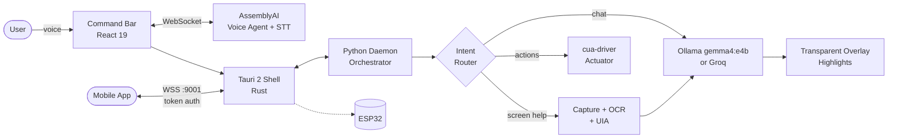

<div align="center">


# Blinky

### The AI desktop tutor that sees your screen, talks you through it, and can do it for you.

Offline-first · Voice-driven · Screen-aware · Controllable from your phone

<br>

[](https://youtu.be/CHFF9J_Jqgw)
[](https://blinky.base44.app)
[](https://docs.google.com/presentation/d/10isbvsbzb3Xm2RzeHyaA_FQqcjUTUzRipflrhuyABRY/edit)
[](https://medium.com/@khannasparsh0001/building-blinky-fighting-captchas-invisible-windows-and-the-agony-of-visualizing-ai-b1247b9fc324?sharedUserId=khannasparsh0001)

<br>


</div>

<br>


---

## Table of Contents

- [Overview](#overview)
- [Features](#features)
- [How It Works](#how-it-works)
- [Tech Stack](#tech-stack)
- [Getting Started](#getting-started)
- [Project Structure](#project-structure)
- [Security and Privacy](#security-and-privacy)
- [Documentation](#documentation)
- [Team](#team)
- [Acknowledgements](#acknowledgements)

---

## Overview

Learning complex software such as VS Code, Blender, or CAD tools usually means bouncing between tutorials, video timestamps, and the app itself. That constant context switching is what people call *tutorial hell*.

**Blinky brings the tutor into the app.** It captures your screen, reads it with OCR and Windows UI Automation, and guides you step by step with live highlights drawn directly over the real interface. Ask by voice, follow the glowing hints, or let Blinky take the wheel with hands-free automation.

| | |
|---|---|
| **Who it's for** | Students, junior developers, and anyone learning unfamiliar desktop software |
| **The problem** | Static manuals, video pacing, and no visual link between instructions and the screen |
| **The solution** | Real-time overlay guidance, voice control, and optional autopilot execution |

---

## Features

### Voice Agent (AssemblyAI)

- **Full voice stack**: speech-to-text (Universal-3 Pro), turn-taking, voice activity detection, and spoken replies.
- **Desktop tool calling**: the voice agent sends a JSON-schema `tool.call` (`control_desktop`), Blinky runs native Windows UI automation, then returns a `tool.result` so the agent can speak the outcome.
- **Realtime STT**: 16 kHz PCM16 audio streams to AssemblyAI's WebSocket API for sub-second transcripts, which feed Blinky's local multi-agent tutor pipeline.
- **Synchronized readback**: the active word highlights in step with the spoken audio.

### Screen-Aware Tutoring

- **Visual overlay**: a transparent Tauri window draws highlights and a companion cursor over the real application.
- **Flicker-free capture**: `SetWindowDisplayAffinity` hides Blinky's own overlay from screenshots, so the model sees a clean screen while you still see Blinky.
- **Hybrid perception**: Windows OCR (with a `pytesseract` fallback), Windows UIA, and Microsoft OmniParser for bounding-box grounding.

### Agent Mode (Computer Use)

Voice-activated actions that need no clicking:

| Action | What Blinky does |
|---|---|
| **Open any app** | Uses protocol URIs, known executable paths, Start Apps, and Windows Search |
| **Play music** | Resolves a track and opens it directly in the Spotify desktop app |
| **Press shortcuts** | Parses natural language like "Ctrl+S" and executes it via `pywinauto` |
| **Autopilot** | Runs a bounded observe-act loop, driven in the background by Hermes `cua-driver` |

### Preflight Intent Router

Before any screenshot is taken, a fast classifier decides what the request actually needs:

| Intent | Behavior |
|---|---|
| `DESKTOP_AUTOMATION` | Screen capture, OCR, and AI overlay |
| `OPEN_APP` | Launches the named app directly |
| `MEDIA_PLAYBACK` | Plays a named song on Spotify |
| `SYSTEM_SHORTCUT` | Presses a keyboard shortcut |
| `INFORMATIONAL_CHAT` | Answers with no screen capture at all |

### Mobile Companion and Hardware

- **Remote workstation control** from an Expo / React Native app over an authenticated, encrypted WebSocket.
- **System screen**: hardware telemetry, power controls, and Wake-on-LAN.
- **Files screen**: remote PC file explorer and camera roll sync.
- **ESP32 firmware**: ambient lighting synchronized with the desktop.
- **WhatsApp automation**: headless Chromium WhatsApp Web backend.

---

## How It Works



---

## Tech Stack

| Layer | Technology |
|---|---|
| **Desktop shell** | Tauri 2 (Rust) |
| **Frontend** | React 19 + TypeScript |
| **Backend** | Python 3.11+ |
| **Voice / STT / TTS** | AssemblyAI Voice Agent API and Realtime STT |
| **Local AI** | Ollama with `gemma4:e4b` |
| **Cloud AI (optional)** | Groq, `llama-3.3-70b-versatile` |
| **OCR** | Windows OCR (WinRT), falls back to `pytesseract` |
| **Screen capture** | `dxcam` (DirectX) |
| **Window detection** | `pywinauto` |
| **Browser automation** | Playwright + Microsoft Edge |
| **Actuation** | Hermes `cua-driver` |
| **Mobile** | Expo SDK 57 / React Native 0.86 |
| **Hosting** | Base44 (landing page and releases) |

---

## Getting Started

### Prerequisites

| Tool | Version | Required |
|---|---|---|
| Bun | 1.3+ | Yes |
| Rust | Stable | Yes |
| Python | 3.11+ | Yes |
| Node.js + Expo CLI | Latest | For mobile companion |
| Ollama | Latest | For local offline inference |
| Docker | Latest | For local SearXNG search |

### 1. Set up the desktop core (one click)

The setup script checks your toolchain, auto-installs what's missing (Bun,
Rust, Python), installs JS + Python packages, Playwright browsers, mobile
deps, and creates your `.env`. Every failure prints a clear error with the
exact fix command. Safe to re-run anytime.

**Windows (recommended)**

```powershell
powershell -ExecutionPolicy Bypass -File setup.ps1
# setup + immediately launch the app:
powershell -ExecutionPolicy Bypass -File setup.ps1 -Run
```

**Linux**

```bash
chmod +x setup.sh && ./setup.sh
# setup + immediately launch the app:
./setup.sh --run
```

### 2. Run Blinky (one click)

```powershell
.\run.ps1     # Windows: validates setup, clears stale ports, picks docker/no-docker
```

```bash
./run.sh      # Linux: same one-click run
```

Or directly with Bun:

```bash
bun run dev
```

| Hotkey | Action |
|---|---|
| `Ctrl` + `Shift` + `Space` | Main hotkey |
| `Ctrl` + `Shift` + `Enter` | Fallback hotkey |

Optional local search engine:

```bash
docker compose -f common/docker-compose.yml up -d
```

### 3. Run the mobile companion (one click, QR included)

Start the desktop app first (`.\run.ps1` / `./run.sh`), then:

```powershell
powershell -ExecutionPolicy Bypass -File setup-mobile.ps1   # Windows
```

```bash
./setup-mobile.sh   # Linux
```

The script installs mobile deps, prints your PC's LAN IP, checks the
desktop backend on port 9001, then starts Expo so the QR code prints in
your terminal. Scan it with Expo Go (or your Blinky dev build), enter the
PC IP in the app, tap **Establish Link**, and test: power actions, remote
AI query over WS `:9001`, file transfer, camera-roll sync. Phone + PC must
be on the same Wi-Fi — or use USB mode (`-Usb` / `--usb`, then IP
`localhost`). Full build notes: `common/mobile/README.md`.

Two ways to link the phone (release builds open on the **QR** tab by default;
debug builds show the manual form):

- **QR (release only, fastest):** in the release PC app, click the **QR icon**
  in the Blinky header → a pairing code appears. In the mobile app's QR tab,
  scan it — you connect instantly, no typing.
- **Manual (all builds):** enter the PC IP (plus token / cert pin for release
  builds), tap **Establish Link**.

---

## Project Structure

```text
Blinky/
├── common/
│   ├── src-tauri/          Tauri 2 Rust shell, WS gateway (:9001), Windows Credential DLL
│   ├── frontend/src/       React 19 webview
│   │   ├── CommandBar.tsx    Floating command hub and voice synthesizer
│   │   ├── Overlay.tsx       Transparent highlight and companion cursor layer
│   │   └── lib/autopilot.ts  Bounded observe-act execution loop
│   ├── mobile/             Expo companion app (dashboard, System, Files, transport)
│   └── python/             AI and automation daemon
│       ├── main.py           Orchestrator and preflight intent classifier
│       ├── computer_use/     Actuation engine (cua-driver backend, tools)
│       ├── ai/               Model routing (Groq / Ollama)
│       ├── ocr/              OmniParser and WinRT OCR
│       └── whatsapp_backend/ Headless WhatsApp Web automation
├── esp32_firmware/         ESP32 ambient lighting micro-daemon
├── docs/                   Architecture, Hermes plan, Linux roadmap, security guides
├── setup.ps1               Windows installer
└── setup.sh                Linux installer
```

---

## Security and Privacy

| Protection | Details |
|---|---|
| **Authenticated transport** | Every mobile command requires a secret `?token=`, hardened against unauthorized LAN access |
| **Strict CSP** | The Tauri webview policy prevents credential exfiltration |
| **Firewall rules** | The Windows NSIS installer adds restrictive inbound rules for port `9001` |
| **Local-first processing** | WinRT OCR and Ollama inference keep screenshots on your machine unless you explicitly enable cloud Groq inference |

---

## Documentation

| Guide | Topic |
|---|---|
| [`HERMES-INTEGRATION-PLAN.md`](docs/HERMES-INTEGRATION-PLAN.md) | `cua-driver` actuator design |
| [`LINUX-PORT-ROADMAP.md`](docs/LINUX-PORT-ROADMAP.md) | Wayland / X11 porting progress |
| [`SECURITY-REMEDIATION.md`](docs/SECURITY-REMEDIATION.md) | WebSocket auth hardening and CSP |
| [`history.md`](docs/history.md) | Architectural evolution after the first 100 commits |
| [`REVENUECAT-AND-ANDROID-DISTRIBUTION-GUIDE.md`](docs/REVENUECAT-AND-ANDROID-DISTRIBUTION-GUIDE.md) | RevenueCat audit and APK packaging |

---

## Team

**Tech Nerds**

| Member | Role | GitHub |
|---|---|---|
| Sparsh Khanna | Voice and UI/UX Architect | [@KhannaSparsh0001](https://github.com/KhannaSparsh0001) |
| Sahil | Backend and Tauri Developer | [@KingSahil](https://github.com/KingSahil) |
| FeV-06 | Mobile and Linux Developer | [@FeV-06](https://github.com/FeV-06) |
| meharwanfr | Linux Developer | [@meharwanfr](https://github.com/meharwanfr) |
| Boldbug | Full-Stack Developer | [@boldbug1](https://github.com/boldbug1) |

---

## Acknowledgements

- [AssemblyAI](https://www.assemblyai.com) for the Voice Agent and Realtime STT APIs
- [cua-driver](https://github.com/nousresearch) by Nous Research for background desktop actuation
- [Sarvam AI](https://sarvam.ai) for multilingual speech (`saaras:v3`, `bulbul:v3`)
- [Microsoft OmniParser](https://github.com/microsoft/OmniParser) and `dxcam` for vision and capture
- [Tauri](https://v2.tauri.app), [React](https://react.dev), [Expo](https://expo.dev), and [React Native](https://reactnative.dev)

---

<div align="center">

Released under the MIT License.

**Ask. Learn. Automate. Control from anywhere.**
