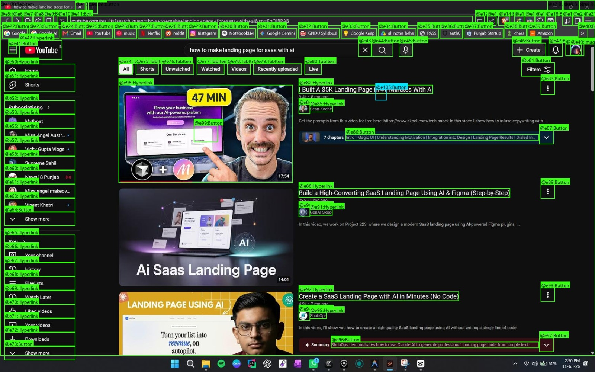
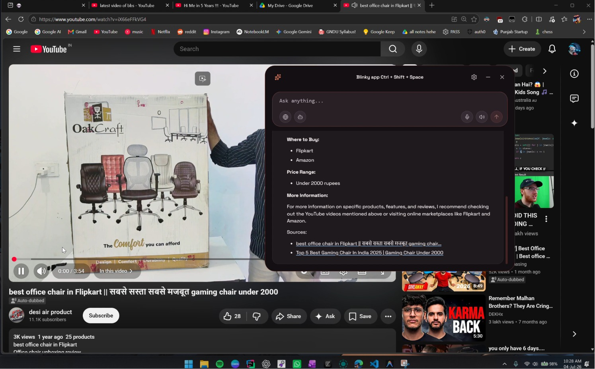
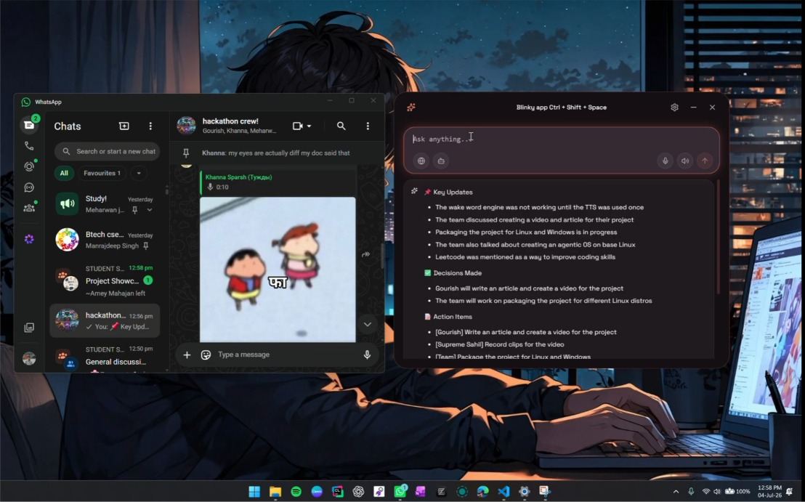
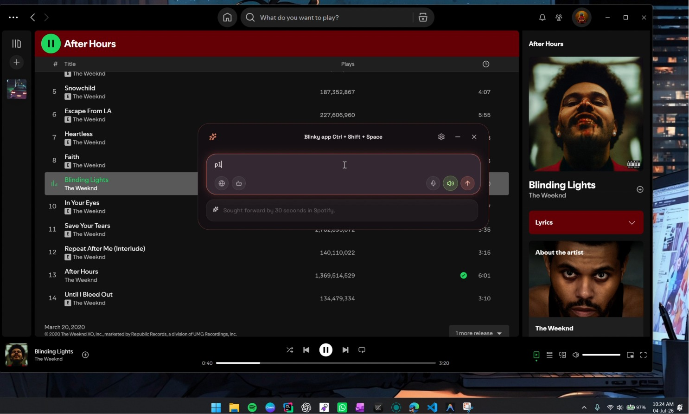
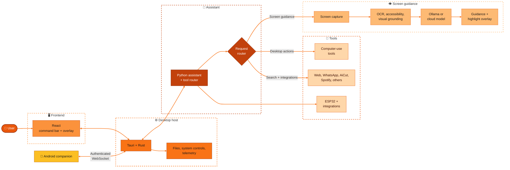

<div align="center">
<picture>
  <source media="(prefers-color-scheme: dark)" srcset="docs/assets/logo_text.png">
  <source media="(prefers-color-scheme: light)" srcset="common/mobile/assets/logo-text-light.png">
  
</picture>

<br>


Screen-aware tutoring · Voice interaction · Desktop automation · Mobile control

<br>

[](https://youtu.be/CHFF9J_Jqgw)
[](https://blinkyy.vercel.app)
[](https://medium.com/@khannasparsh0001/building-blinky-fighting-captchas-invisible-windows-and-the-agony-of-visualizing-ai-b1247b9fc324?sharedUserId=khannasparsh0001)

<br>


</div>

<br>

## Overview

Learning complex desktop software often means switching between tutorials, documentation, and the application itself. Blinky brings help into the workflow: ask a question about the current screen, get a grounded next step, and see the relevant control highlighted in the app. When requested, Blinky can also carry out bounded desktop actions. A companion app extends selected controls to an Android phone.

| | |
|---|---|
| **For** | Students, developers, and anyone learning unfamiliar desktop software |
| **Problem** | Tutorials and documentation are disconnected from the interface being learned |
| **Approach** | Screen understanding, contextual guidance, visual highlights, voice, and optional automation |

## Features

| Capability | What it does |
|---|---|
| **Screen-aware tutoring** | Captures the active screen, combines OCR with accessibility or visual UI detection, and gives step-by-step guidance with on-screen highlights. |
| **Voice interaction** | Supports realtime speech input, voice-agent tool calls, spoken responses, turn-taking, and synchronized readback through configured voice providers. |
| **Hey Blinky wake word** | Runs the bundled `python/hey_blinky.onnx` model locally through ONNX Runtime to detect the wake phrase and start hands-free interaction. |
| **Agent Mode** | Uses a bounded observe-and-act loop for app launching, keyboard shortcuts, typing, scrolling, and grounded clicks. |
| **Linux desktop support** | Provides native capture, OCR, application launching, input, scrolling, and system controls. Hyprland is the primary Wayland path; available behavior varies by desktop environment. |
| **WhatsApp and AI summaries** | Connects WhatsApp Web by QR code, reports connection status, lists chats, and creates recaps of selected group or direct conversations. |
| **AiCut video editing** | Handles natural-language trim and merge requests, audio, captions, subtitle generation, script alignment, and caption styles with FFmpeg and faster-whisper. |
| **Web research** | Uses the Web Intelligence Layer and SearXNG to retrieve pages and return synthesized answers with clickable sources. Public search fallbacks are available when configured local search is unavailable. |
| **Browser and app tools** | Provides persistent browser automation, application launching, Spotify playback, product search, YouTube channel statistics, cryptocurrency prices, and Wikipedia lookups. |
| **Android companion** | Connects to the desktop over an authenticated WebSocket for remote chat, voice, quick actions, and PC controls over LAN, USB, or Tailscale. |
| **Remote files and camera transfer** | Browses PC files, transfers files between phone and computer, syncs camera selections, and sends media into supported AiCut workflows. |
| **PC power and Wake-on-LAN** | Shows system telemetry and supports lock, sleep, hibernate, restart, shutdown, and Wake-on-LAN for appropriately configured hardware and networks. |
| **Antigravity IDE bridge** | Sends prompts from mobile, streams IDE activity, and reports final responses or requests for user input. |
| **ESP32 lighting** | Controls RGB color and brightness through the Blinky ESP32 daemon. |
| **Android access options** | Integrates RevenueCat purchase and entitlement handling, with configured promo codes available for PC-control access. |

Some capabilities need API credentials, optional system packages, or connected hardware. Local Ollama inference is available; selecting a cloud AI or voice provider sends the relevant request data to that provider.

## Showcase

<div align="center">
  <table>
    <tr>
      <td colspan="4">
        <video src="https://github.com/user-attachments/assets/2ce70a03-9747-4155-95bb-dba7d92374ef" width="100%" controls muted></video>
      </td>
    </tr>
    <tr>
      <td>
        
      </td>
      <td>
        
      </td>
      <td>
        
      </td>
      <td>
        
      </td>
    </tr>
  </table>
</div>


## Architecture



| Layer | Main components |
|---|---|
| Desktop interface | React 19, TypeScript, Tauri 2, and Rust |
| Assistant | Python 3.11+, request routing, AI clients, tools, and screen understanding |
| Vision and input | Windows capture/UIA, Linux desktop backends, OCR, and configurable OmniParser grounding |
| AI and voice | Ollama, optional Groq and other configured providers, AssemblyAI and Sarvam voice integrations |
| Search and media | SearXNG/WIL, Playwright, FFmpeg, faster-whisper, and the AiCut service |
| Mobile | Expo and React Native with authenticated desktop transport |

## Installation

### Requirements

| Requirement | Needed for |
|---|---|
| Git | Clone the repository |
| Bun 1.3 or newer | Desktop JavaScript dependencies and development scripts |
| Python 3.11 or newer | Assistant backend and platform packages |
| Rust stable toolchain | Tauri desktop application |
| Ollama or a configured cloud AI provider | Assistant responses |
| Docker Compose | Optional local SearXNG search service |
| Android Studio/SDK and ADB | Building or connecting the Android companion |

Windows is the primary desktop setup. Linux has a separate setup path and additional desktop packages; consult the Linux guide for supported environments and requirements.

### Windows desktop

```powershell
git clone https://github.com/KingSahil/Blinky.git
cd Blinky
powershell -ExecutionPolicy Bypass -File setup.ps1
```

The setup script installs the project dependencies, prepares the Python environment, installs the Playwright browser, and creates `.env` from the example when needed. It does not add API keys for you.

Install Ollama and pull the configured local model if you want local inference:

```powershell
ollama pull gemma4:e4b
```

Set the AI provider and any optional provider keys in `.env`. Keep credentials private and do not commit `.env`.

Start Blinky:

```powershell
bun run dev
```

To run without starting the local Docker search service:

```powershell
bun run dev:no-docker
```

### Linux desktop

```bash
git clone https://github.com/KingSahil/Blinky.git
cd Blinky
bun run setup:linux
```

Install the system packages required by your distribution and desktop session as described in [`linux/quick_start.md`](linux/quick_start.md). For local AI, install Ollama, start its service, and pull `gemma4:e4b`. Configure `.env`, then run:

```bash
bun run dev
```

Linux capabilities depend on the compositor and installed utilities. The current native implementation is Hyprland-first; see the [Linux port roadmap](docs/LINUX-PORT-ROADMAP.md) for GNOME and KDE status.

### Android companion

The mobile app is in `common/mobile`. Start the Expo development server with:

```bash
cd common/mobile
bun install
bun run start
```

For a native Android build, use the provided `install_apk.bat` workflow or the [Android distribution guide](docs/REVENUECAT-AND-ANDROID-DISTRIBUTION-GUIDE.md). Some native modules and RevenueCat purchase flows require a development build or standalone APK rather than the standard Expo Go client. Connect the phone and desktop through the app's pairing flow; the desktop WebSocket listener uses port `9001` by default.

### Optional local web search

The desktop development script starts SearXNG through Docker Compose when Docker is available. To start it directly:

```bash
docker compose -f common/docker-compose.yml up -d
```

## Project structure

| Path | Contents |
|---|---|
| `common/frontend/` | React command bar, visual overlay, voice, guidance, and autopilot UI |
| `common/src-tauri/` | Tauri desktop host, Rust platform services, authenticated WebSocket, and file transfer |
| `common/python/` | Assistant orchestration, screen capture, OCR, AI clients, computer use, web research, and tools |
| `common/whatsapp_backend/` | WhatsApp Web session, chat, and summary service |
| `common/aicut/` | C++ video processing components used by AiCut |
| `common/mobile/` | Expo/React Native Android companion, remote control, files, and system screens |
| `windows/` | Windows-specific Python, Rust, setup, and system integrations |
| `linux/` | Linux desktop backends, setup scripts, and quick-start guide |
| `python/` | Shared wake-word listener and bundled `hey_blinky.onnx` model |
| `esp32_firmware/` | ESP32 universal daemon firmware for lighting and device control |
| `docs/` | Platform, security, voice, distribution, and architecture guides |
| `local-docs/` | Runtime flow, configuration, testing, and release notes |

## Configuration and privacy

The desktop setup creates the root `.env` from `.env_example` when needed. Configure only the providers and integrations you plan to use. Mobile RevenueCat and promo-code values belong in `common/mobile/.env`. Common settings include:

| Setting | Purpose |
|---|---|
| `BLINKY_AI_PROVIDER` | Selects the assistant model provider |
| `GROQ_API_KEY` | Enables Groq cloud inference |
| `SARVAM_API_KEY` | Enables Sarvam speech services |
| `ASSEMBLY_AI_API_KEY` | Enables AssemblyAI voice services |
| `ESP32_HOST` | Address of the ESP32 daemon |
| `EXPO_PUBLIC_REVENUECAT_GOOGLE_KEY` | RevenueCat Android public SDK key |
| `EXPO_PUBLIC_PROMO_CODES` | Configured Android promo-code access options |

Keep `.env` and all secret keys out of source control. The mobile desktop connection uses authentication and TLS support. Screen, microphone, and message data may be sent to the cloud services you configure; review each provider's terms and settings before enabling it. Local Ollama inference keeps model requests on the local machine.

## Documentation

| Guide | Covers |
|---|---|
| [`linux/quick_start.md`](linux/quick_start.md) | Linux dependencies, inference setup, OCR, and launch steps |
| [`docs/LINUX-PORT-ROADMAP.md`](docs/LINUX-PORT-ROADMAP.md) | Linux backends and desktop-environment support status |
| [`docs/ASSEMBLYAI_VOICE_AGENT.md`](docs/ASSEMBLYAI_VOICE_AGENT.md) | AssemblyAI voice-agent integration |
| [`docs/HERMES-INTEGRATION-PLAN.md`](docs/HERMES-INTEGRATION-PLAN.md) | Computer-use architecture and integration notes |
| [`docs/SECURITY-REMEDIATION.md`](docs/SECURITY-REMEDIATION.md) | Security design and remediation details |
| [`docs/REVENUECAT-AND-ANDROID-DISTRIBUTION-GUIDE.md`](docs/REVENUECAT-AND-ANDROID-DISTRIBUTION-GUIDE.md) | Android builds, billing, entitlements, and promo codes |
| [`common/mobile/APP-FLOW.md`](common/mobile/APP-FLOW.md) | Mobile app screens and user flows |
| [`local-docs/ARCHITECTURE.md`](local-docs/ARCHITECTURE.md) | Current runtime architecture |
| [`local-docs/CONFIGURATION.md`](local-docs/CONFIGURATION.md) | Environment and configuration reference |
| [`local-docs/TESTING.md`](local-docs/TESTING.md) | Existing verification and test workflows |
| [`common/ai_docs/00_repo_summary.md`](common/ai_docs/00_repo_summary.md) | Developer-oriented repository map and reading order |
| [`common/ai_docs/10_aicut_video_editor.md`](common/ai_docs/10_aicut_video_editor.md) | AiCut video editor architecture and operations |

## Contributors

| Contributor | GitHub | Contribution area |
|---|---|---|
| Sparsh Khanna | [@KhannaSparsh0001](https://github.com/KhannaSparsh0001) | Voice integration and product interface |
| Sahil | [@KingSahil](https://github.com/KingSahil) | Backend and Tauri desktop application |
| FeV-06 | [@FeV-06](https://github.com/FeV-06) | Mobile application and Linux development |
| meharwanfr | [@meharwanfr](https://github.com/meharwanfr) | Linux desktop development |
| Divyam | [@divi912](https://github.com/divi912) | Mobile file transfer and destination-aware media workflows, WSS implmentation |
| Vedant | [@vedanthaha](https://github.com/vedanthaha) | Mobile interface and usability improvements |
|Boldbug | [@boldbug1](https://github.com/boldbug1) | Automated QR pairing , setup files ,docs maintainence |

## Acknowledgements

- AssemblyAI for realtime speech recognition and voice-agent services
- Sarvam AI for speech services
- Nous Research for the `cua-driver` computer-use backend
- Microsoft for OmniParser
- Tauri, React, Expo, and React Native for the application frameworks
- The Blinky contributors and users who have tested the desktop and mobile workflows

<div align="center">

**Ask. Learn. Automate. Control from anywhere.**

</div>
