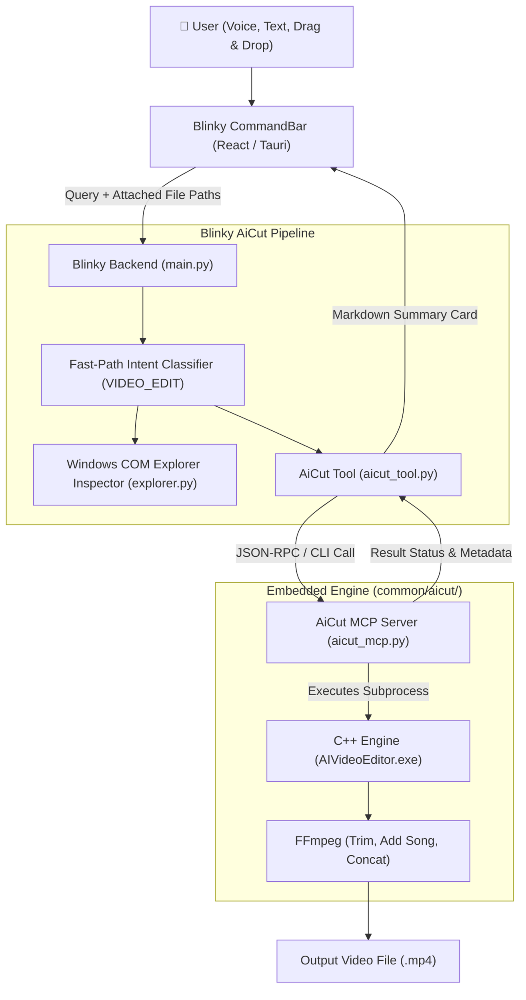

# 10. AiCut Video Editor & MCP Architecture

Blinky embeds **AiCut** (`common/aicut/`) as an AI desktop video editor controlled through voice, natural language text, and ChatGPT-style drag-and-drop media attachments.

---

## 🏗️ Architectural Overview

---

## 🛠️ Supported Video Editing Operations

### 1. Trimming Videos (`trim`)
- **CLI**: `AIVideoEditor.exe trim --input <in.mp4> --output <out.mp4> --start <t1> --end <t2>`
- **Behavior**: Uses FFmpeg stream copying without re-encoding (`-c copy`) for near-instant lossless trimming.

### 2. Adding Background Music (`add-song`)
- **CLI**: `AIVideoEditor.exe add-song --video <in.mp4> --song <music.mp3> --output <out.mp4> --music-volume <0.0-1.0>`
- **Behavior**: Mixes music under original video audio using `amix=inputs=2:duration=longest:dropout_transition=2` and AAC audio encoding.

### 3. Merging Multiple Videos (`merge`)
- **CLI**: `AIVideoEditor.exe merge --inputs <v1.mp4,v2.mp4,...> --output <out.mp4>`
- **Behavior**: Solves FFmpeg mismatched parameter errors by normalizing each stream:
  - Video: `scale=1280:720:force_original_aspect_ratio=decrease,pad=1280:720:(ow-iw)/2:(oh-ih)/2,setsar=1,fps=30,format=yuv420p`
  - Audio: `aformat=sample_rates=44100:channel_layouts=stereo`
  - Concat: `concat=n=N:v=1:a=1`

### 4. Burning Styled Subtitles (`subtitles`)
- **Tool**: `aicut_burn_subtitles`
- **Behavior**: Converts `.srt` subtitles into styled `.ass` (Advanced SubStation Alpha) and burns them directly into video frames with FFmpeg `libass`.
- **Auto-Transcription**: If no `.srt` file is supplied, it automatically transcribes the video audio using `faster-whisper` first, generates the SRT, and burns it in one pass.
- **16 Presets**:
  - *Viral*: `hormozi` (yellow keyword pop), `word-karaoke` (`\k` fill), `pill-yellow`, `pill-red`, `typewriter`, `color-switch`
  - *Business/Edu*: `hormozi-clean`, `keyword-green`, `lecture-dual`
  - *Cinematic*: `documentary` (BBC compliant), `cinematic-lowerthird`, `quiet-minimal`, `glassmorphism`
  - *Stylized*: `neon-blur` (magenta glow), `meme-impact` (Anton bold), `retro-yellow` (Bebas Neue)

### 5. Local Speech-to-Text Transcription (`transcribe`)
- **Tool**: `aicut_transcribe_audio`
- **Behavior**: Transcribes audio/video to `.srt` locally on-device using CTranslate2-accelerated `faster-whisper` (`tiny`, `base`, `small`, `medium`, `large-v3`). No cloud API keys or external servers required.

### 6. Inspecting Media Metadata (`media_info`)
- **Tool**: `aicut_get_media_info`
- **Behavior**: Calls `ffprobe` to retrieve video resolution, duration, frame rate, audio sample rate, and codec info.

---

## 📁 Embedded Component Layout

- **`common/aicut/`**:
  - `include/`: C++ header definitions (`MergeEngine.h`, `TrimEngine.h`, `MusicMergeEngine.h`, `CommandLineParser.h`).
  - `src/`: C++ implementations.
  - `tests/`: C++ unit tests (`MergeEngineTests.cpp`, `TrimEngineTests.cpp`, `MusicMergeEngineTests.cpp`, `CommandLineParserTests.cpp`).
  - `build/`: Contains compiled `AIVideoEditor.exe` and test executables.
  - `aicut_mcp.py`: Model Context Protocol server exposing JSON-RPC 2.0 stdio tools.
  - `mcp_config.json`: MCP server configuration.
- **`common/python/tools/aicut_tool.py`**:
  - Blinky tool parsing natural language requests (`add this song in this video`, `trim from 2 to 5s`, `merge clips`).
  - Resolves referenced files from drag-and-drop attachments or Windows File Explorer.
- **`common/python/utils/explorer.py`**:
  - Windows COM `Shell.Application` inspector reading active Explorer folder, selection, and media files.

---

## 🎤 Push-to-Talk & Hotkey Architecture

- **`Win + Space` (`Super + Space`)**: Windows native background polling thread in `windows/src-tauri/src/platform/windows.rs` monitors `VK_LWIN` / `VK_RWIN` and `VK_SPACE` to trigger global push-to-talk.
- **`Ctrl + Shift + Enter`**: Global shortcut in `lib.rs` to show/hide the Blinky window.
- **`Shift + Enter`**: Inserts line breaks in the prompt textarea.
