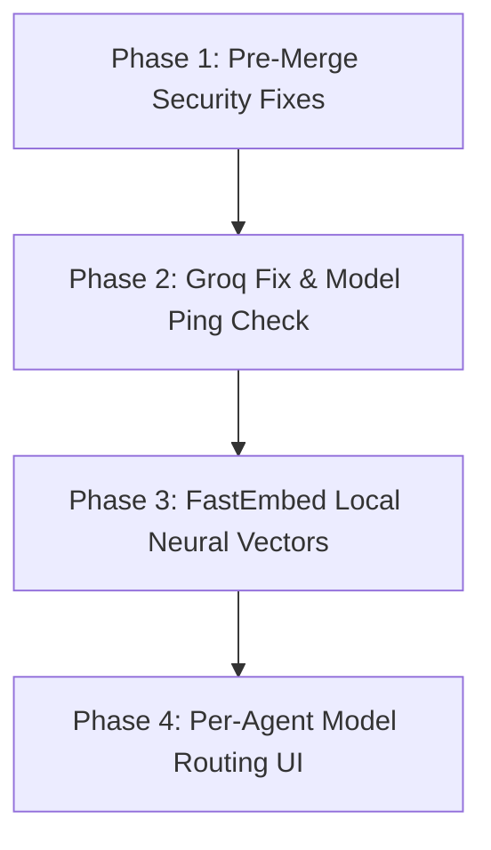

# 📋 OKF + RAG Action Plan & Architecture Guide (v2.0)

> [!NOTE]
> **Document Purpose:** Central blueprint for Blinky's **Open Knowledge File (OKF)**, **RAG Engine**, **Multi-Provider Architecture**, and **Per-Agent Model Selection**.
> 
> ✍️ **Interactive Review:** Use the `💬 Feedback & Notes` sections to add thoughts or approvals!

---

## 1. 🛡️ Pre-Merge Security & Quality Remediations (CodeRabbit)

| Issue | Severity | Location | Fix Summary |
| :--- | :---: | :--- | :--- |
| **PDF Redaction Regex** | 🔴 High | `common/python/tools/pdf_security.py` | Use `re.finditer()` on page text to get literal coordinate matches. Remove silent copy in `except:`, raise `RuntimeError`. |
| **Explorer Directory Mutate** | 🔴 High | `common/python/tools/pdf_tool.py` | Stop iterating directory on empty selection. Return empty list and require explicit file selection. |
| **Unauthenticated Discovery** | 🔴 High | `common/src-tauri/src/websocket.rs` | Remove `"token"` from public `/discover` (port 9004). Enforce `has_presented_token && authenticated` on `get_api_keys`. |
| **Mobile Plaintext Keys** | 🟡 Medium | `common/mobile/lib/secure_keys.ts` | Delete `AsyncStorage` fallback copy when `SecureStore` succeeds. Add `clearSyncedApiKeys()` on disconnect. |
| **Vector Store Source Filtering** | 🟡 Medium | `notebook_manager.py` & `vector_store.py` | Filter SQLite chunks by active source names. Purge chunk rows when a notebook is deleted. |
| **Context Prompt Injection** | 🟡 Medium | `okf_context_builder.py` | Wrap chunks in `<context_source name="...">...</context_source>` XML with strict untrusted data prompt rules. |
| **Vulnerable `pypdf`** | 🟡 Medium | `requirements.txt` / setup scripts | Pin `pypdf>=6.1.0` to address DoS security advisories. |
| **Rust Clippy Warnings** | 🔧 Tooling | `common/src-tauri` | Apply 22 compiler fixes (`&PathBuf` -> `&Path`, dereference cleanup). |

---

## 2. 🏛️ Information Architecture: "Chats" vs "Notebooks"

### 2.1. The User's Mental Model
The names of models are symbolic implementation details; the user's primary mental distinction is:
> **"Do I want to talk to my computer / execute actions?"** vs **"Do I want to work with and research my documents?"**

```text
                        BLINKY ECOSYSTEM
                               │
             ┌─────────────────┴─────────────────┐
             │                                   │
       💬 CHATS                           📚 NOTEBOOKS
       [+ New Chat]                       [+ New Notebook]
             │                                   │
   • Fast & Transient                  • Persistent Research Hub
   • Screen-aware & Computer-Use       • Source-grounded (PDF/MD/TXT)
   • Web search (SearXNG)              • Neural Vector Indexing
   • Voice & OS automation             • Multiple chat threads per notebook
```

### 2.2. Mobile App Experience: Single Unified Window & Persistent Sessions
* **User Directive:** "the mobile should have only one window for it" + "store sessions of what was asked to Blinky like every chat bot application does".
* **Single Unified Window Architecture:**
  - Eliminate the fragmented two-window experience (separate `Chat` vs `Notebook` tabs).
  - Mobile has **ONE primary Chat window** with Blinky that handles both:
    - **General PC Assistant:** Direct PC control, OS actions, voice queries, vision execution.
    - **Knowledge & RAG Grounding:** Seamlessly attach a document (`📎 Attach PDF/Doc`) or link a Notebook directly into the active chat session.
  - The bottom navigation simplifies to: `Chat` (Unified General + Knowledge), `Actions`, `Files`, `PC`.
* **Chat Session History Storage (AsyncStorage):**
  - Just like ChatGPT/Gemini, every command and conversation with Blinky is saved to device storage (`@blinky_chat_sessions_v1`).
  - Features:
    - Multi-session drawer/history list with titles auto-generated from initial requests.
    - Quick "New Chat" button to start a fresh interaction.
    - Full persistence across mobile app relaunches, backgrounding, and reconnections.
    - Optional export/purge of session history for privacy.

### 2.3. Is Chat History Accessible in the PC Version? (Current State vs Target Architecture)

#### 🔴 Current Reality: NO, PC Has Zero Persistent Chat History
* In the PC desktop app (`common/frontend/src/CommandBar.tsx`):
  - History is stored in a temporary in-memory React ref: `conversationHistoryRef.current.slice(-8)`.
  - It only retains the last 8 messages in RAM to supply context to the LLM during the current active task.
  - **The moment you press `Escape`, close the CommandBar, or restart the PC app, all chat and command history is permanently destroyed.**
  - There is currently **no history sidebar, no past session log, and no way to review prior tasks** on the desktop.

#### 🟢 The Unified Solution: Cross-Platform Session Store (PC + Mobile)
We are introducing a shared session schema so both PC and Mobile have full, persistent chat history:

```typescript
export interface BlinkyChatSession {
  id: string;               // e.g. "session_1738392019_abc"
  title: string;            // Auto-generated from 1st prompt: e.g. "Redact Tax PDF"
  createdAt: number;        // Epoch ms
  updatedAt: number;        // Epoch ms
  mode: 'general' | 'grounded';
  linkedNotebookId?: string;// If linked to a Notebook for RAG
  messages: Array<{
    id: string;
    sender: 'user' | 'blinky' | 'system';
    text: string;
    timestamp: string;
    steps?: any[];          // Action steps executed on PC
    status?: string;
  }>;
}
```

```text
┌────────────────────────────────────────────────────────────────────────┐
│                      CROSS-PLATFORM SESSION SYNC                       │
├───────────────────────────────────┬────────────────────────────────────┤
│ 📱 MOBILE (Android / iOS)         │ 💻 PC DESKTOP (Tauri Spotlight)    │
├───────────────────────────────────┼────────────────────────────────────┤
│ • Local storage: AsyncStorage     │ • Local storage: localStorage      │
│ • UI: Header "☰ History" Drawer   │ • UI: CommandBar "<Clock/> History"│
│ • [+ New Chat] button             │ • [+ New Session] shortcut (Ctrl+N)│
│ • Auto-titles from first prompt   │ • Restores full execution steps    │
├───────────────────────────────────┴────────────────────────────────────┤
│ 🔄 Real-time WebSocket Sync (Port 9001/9002):                          │
│   Commands issued on Phone appear immediately in PC Desktop History.  │
│   Tasks run on PC are viewable and resumeable on Mobile!               │
└────────────────────────────────────────────────────────────────────────┘
```

---

## 3. 🔍 How RAG Works & The Missing Local Embedding Model

### 3.1. Why Current Blinky Vector Search Sometimes Returns 0 Results
In `common/python/notebooks/vector_store.py`, Blinky currently uses **lexical Term Frequency (TF) cosine math** (exact keyword matching with regex) rather than a real **Neural Embedding Model**:
* If a document says *"The vehicle was repaired"* and you search *"automobile fix"*, keyword overlap is `0`, cosine distance is `0.0`, and search **silently returns no results**.

### 3.2. Free & Open-Source Local Embedding Models: What Does It Cost?
* **Cost:** **$0.00 (100% Free & Open Source).**
* **Recommended Local Embedding Model:** `fastembed` with `BAAI/bge-small-en-v1.5` or `all-MiniLM-L6-v2`.
  - **Download Size:** ~80 MB to 130 MB (downloaded once locally).
  - **Memory:** ~120 MB RAM.
  - **Speed:** ~5ms per chunk on normal CPU (no GPU required!).
  - **Offline:** Works 100% locally with zero internet, zero API keys, and zero rate limits.
* **Alternative Local Option:** `ollama pull nomic-embed-text` (274 MB, running through existing Ollama integration).
* **Cloud Free Option:** Google `text-embedding-004` (Free tier on Google AI Studio).

---

## 4. ⚡ Modern AI Models & Overcoming Groq Limits

### 4.1. Active Google Gemini Free-Tier Models (2026)
Older models like `gemini-1.5-flash` and `gemini-2.0-flash` have been succeeded by the modern active line:

| Model | API Model ID | Free Tier? | Best Use in Blinky |
| :--- | :--- | :---: | :--- |
| **Gemini 3.8 Flash** | `gemini-3.8-flash` | ✅ | Heavy reasoning, coding, long-document RAG |
| **Gemini 3.6 Flash** | `gemini-3.6-flash` | ✅ | Multimodal screen analysis & vision |
| **Gemini 3.5 Flash** | `gemini-3.5-flash` | ✅ | Fast general-purpose queries |
| **Gemini 3.1 Flash-Lite** | `gemini-3.1-flash-lite` | ✅ | High-volume RAG chunk synthesis (zero lag) |
| **Gemini 2.5 Flash** | `gemini-2.5-flash` | ✅ | Stable reasoning & document analysis |
| **Gemini 2.5 Flash-Lite** | `gemini-2.5-flash-lite` | ✅ | Lightweight tasks & low quota consumption |
| **Gemini 3.8 Live** | `gemini-3.8-live` | ✅ | Real-time duplex voice streaming |

### 4.2. Why the Mobile App Errored on Groq
Your phone displayed:
```text
Groq API Error: The model 'llama-3.3-70b-versatile' does not exist or you do not have access to it.
```
Groq decommissioned `llama-3.3-70b-versatile`. Active Groq models verified today on your key:
* `qwen/qwen3.8-27b` (131k context window)
* `openai/gpt-oss-120b` (131k context window)
* `openai/gpt-oss-20b` (131k context window)

---

## 5. 🚀 The "Blinkified" Per-Agent Custom Model Selection

Adapted from HayMagnet's flexible architecture, Blinky eliminates hardcoded single-provider lock-in by introducing **Per-Agent Model Assignment** with **Live 1-Token Health Checks**:

```text
┌────────────────────────────────────────────────────────┐
│ ⚙️ BLINKY AI AGENT & MODEL CONFIGURATION              │
├────────────────────────────────────────────────────────┤
│                                                        │
│ 1. 👁️ Computer-Use & Vision Agent                       │
│    Provider: [ Groq                 ▼ ]                │
│    Model:    [ qwen/qwen3.8-27b     ▼ ] [ Test Ping ⚡]│
│                                                        │
│ 2. 📚 Knowledge Hub & RAG Agent                        │
│    Provider: [ Google Gemini        ▼ ]                │
│    Model:    [ gemini-3.8-flash     ▼ ] [ Test Ping ⚡]│
│                                                        │
│ 3. 🎙️ Real-Time Voice & Action Agent                   │
│    Provider: [ Groq / Fast          ▼ ]                │
│    Model:    [ openai/gpt-oss-20b   ▼ ] [ Test Ping ⚡]│
│                                                        │
│ 4. 🛡️ Offline / Local Fallback Agent                   │
│    Provider: [ Local Ollama         ▼ ]                │
│    Model:    [ qwen2.5:7b           ▼ ] [ Test Ping ⚡]│
│                                                        │
│ [ Custom Model ID Entry: e.g. deepseek-ai/DeepSeek-V3 ]│
│                                                        │
│ [✓] Auto-fallback to next active provider on 429/TPM   │
└────────────────────────────────────────────────────────┘
```

### Key Capabilities:
1. **Specialized Task-to-Model Routing:**
   - **RAG & Documents:** Routed to `gemini-3.8-flash` or `gemini-2.5-flash` for massive 1M-token context windows and zero rate-limit issues.
   - **Desktop Computer-Use:** Routed to `qwen/qwen3.8-27b` on Groq for ultra-fast vision coordinates and tool execution.
   - **Fast Voice Commands:** Routed to lightweight 20B models on Groq for sub-300ms speech synthesis.
2. **Custom Model ID & Local Endpoints:**
   - Users can manually type any model ID or connect any local OpenAI-compatible endpoint (LM Studio, vLLM, Ollama).
3. **Live 1-Token Connection Check (`Test Ping ⚡`):**
   - Before saving settings, users can click "Test Ping". The backend sends a 1-token test prompt (`"ping"`) to verify the key is valid and the model is currently active.
   - **Prevents decommissioned model crashes like `llama-3.3-70b-versatile` before the user ever enters chat!**
4. **Resilient 429 / TPM Cascade:**
   - If Groq returns `429 Rate Limit (TPM exhausted)`, Blinky automatically retries the query against the secondary configured provider (e.g. Gemini or Ollama) instead of failing.

---

## 6. 🗺️ Implementation Roadmap



| Phase | Milestone | Deliverable | Status |
| :--- | :--- | :--- | :---: |
| **Phase 1** | **CodeRabbit Remediation** | Fix PDF regex redaction, fix Explorer selection, strip `/discover` token, secure mobile AsyncStorage, clippy warnings. | ✅ **COMPLETED** |
| **Phase 2** | **Active Model Update & Ping Check** | Update mobile/desktop Groq default to `qwen/qwen3.8-27b`, add live 1-token test check to Settings modal & CommandBar. | ✅ **COMPLETED** |
| **Phase 3** | **Neural Local RAG** | Replace raw TF keyword math in `vector_store.py` with `fastembed` local embeddings ($0 cost, 80MB). | ⏳ Next |
| **Phase 4** | **Single-Window Mobile & Cross-Platform History** | Unify mobile chat into 1 window with document grounding, add session history drawer on Mobile & PC, and per-agent model routing. | ⏳ Scheduled |

> [!TIP]
> 💬 **Feedback & Next Action:**
> Ready to execute Phase 1 and update the model references!
