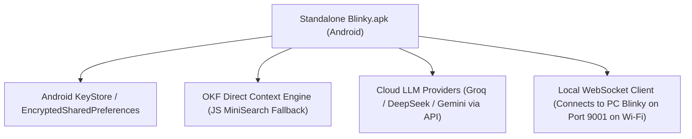

# Blinky Notebook Hub: OKF & RAG Architecture Plan

## Executive Overview & Core Philosophy

The **Blinky Notebook Hub** is an in-app personal intelligence workspace (inspired by NotebookLM) designed for both Desktop (Tauri + Python) and Standalone Mobile (`Blinky.apk` via Expo).

### Key Architectural Principle: OKF as a Direct Substitute for RAG
For smaller documents, PDFs, notes, and application guides (which fit easily into modern 128k–1M context windows), traditional vector RAG is unnecessary overkill that fragment context. 

Instead, **OKF (Offline Knowledge Format)** acts as a direct, high-density full-context substitute for RAG:
- **Full-Context Fidelity:** Rather than splitting a 10-page document or app manual into small vector chunks and losing cross-paragraph coherence, OKF formats the document into structured, high-density Markdown.
- **Zero Embedding Latency:** Eliminates heavy vector embedding generation on mobile devices and low-spec PCs.
- **Actionable Execution:** Contains inline navigation metadata (`shortcuts`, `menu paths`, `button coordinates`) so Blinky can execute actions directly on Windows desktop when linked.
- **RAG Fallback:** Traditional vector retrieval (via `sqlite-vec` / `BM25`) is reserved *only* as a fallback when total document size exceeds the active model's context window.

---

## 1. Product Capabilities & Workflow

1. **Source Ingestion:** Users drop local PDFs, Markdown files, web clips, or attach live desktop application guides (**OKF**).
2. **OKF Full-Context Processing:** Small/medium documents are converted into OKF structured format and injected directly into the LLM context for 100% accurate recall.
3. **Multi-Model Provider Support:** Query notebooks using **Groq** (cloud speed), **Ollama** (100% offline privacy), **DeepSeek**, or **Gemini**.
4. **Citations & Grounded Answers:** Every response includes exact source badges (`[Source: manual.pdf]`).
5. **Actionable PC Execution:** If a source mentions software workflows (e.g. *"How to export audio in FL Studio"*), clicking the citation displays a **"▶ Execute on PC"** button that runs the action on Windows.
6. **Studio Artifacts:** One-click generation of Executive Summaries, FAQs, Action Items, and Study Guides.

---

## 2. Standalone Android APK & Security Architecture

The mobile app is designed and compiled as a **100% standalone native Android binary (`Blinky.apk`)** using Expo (`npx expo run:android --variant release` or `eas build`).



### Key Exchange & Offline Mobile Independence:
1. **Encrypted Key Transfer:** When Mobile pairs with Desktop Blinky over WebSocket (Port 9001), Desktop securely transfers encrypted API keys (`Groq`, `OpenAI`, `Gemini`).
2. **Hardware Security Storage:** Mobile saves these keys in **Android KeyStore** (`EncryptedSharedPreferences`).
3. **PC-Offline Autonomy:** When the PC is turned off, `Blinky.apk` reads stored keys from KeyStore and queries cloud LLM APIs directly from the phone.

---

## 3. Desktop vs. Standalone Mobile Feature Matrix

| Feature | Desktop Mode (PC Connected) | Standalone Mobile Mode (PC Off) |
| :--- | :--- | :--- |
| **API Keys** | Loaded from local PC environment/settings | Synced securely to Android KeyStore |
| **Context Strategy** | Full-Context OKF + Local `sqlite-vec` for massive files | Full-Context OKF + `MiniSearch` JS Engine |
| **OKF Action Execution** | Answers + Executes physical click/shortcut on PC screen | Answers questions + displays step-by-step guide |
| **Supported Models** | Groq, Ollama (Local), DeepSeek, Gemini | Groq, DeepSeek, Gemini (Cloud via API) |

---

## 4. Implementation Phases

### Phase 1: OKF & Ingestion Engine (`common/python/notebooks/`)
- `notebook_manager.py`: Notebook CRUD operations and source tracking.
- `document_parser.py`: PDF, TXT, MD, and HTML parser converting files directly into OKF high-density Markdown.
- `okf_context_builder.py`: Formats active sources into structured LLM context prompts.

### Phase 2: Model Dispatch & Action Grounding
- Connect OKF context builder to `common/python/ai/client.py` enforcing grounded citation output.
- Link `app_context/registry.py` so active desktop app guides can be attached as living sources.

### Phase 3: Desktop UI Component (`NotebookView.tsx`)
- Build a 3-column workspace:
  - **Left Column:** Sources (PDFs, OKF app guides) + "Add Source" upload.
  - **Center Column:** Interactive Grounded Chat with source badges and "Execute on PC" buttons.
  - **Right Column:** Studio Artifacts (Executive Summary, FAQ, Action Plan).

### Phase 4: Standalone Mobile View (`common/mobile/NotebookScreen.tsx`)
- Add a **Notebooks** tab in Expo mobile app.
- Enable PDF/Document import on Android.
- Persist synced API keys in `Expo SecureStore` for offline Mobile usage.

---

## 5. Compiling the Standalone `.apk` from Expo

Expo compiles directly into a standalone Android binary without dev server or Expo Go dependencies:

```bash
# Local machine build (generates app-release.apk)
npx expo run:android --variant release

# EAS cloud build
eas build --platform android --profile preview
```
